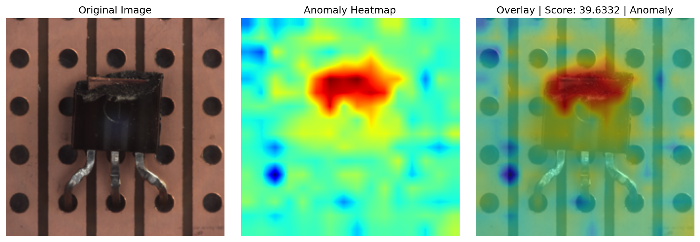
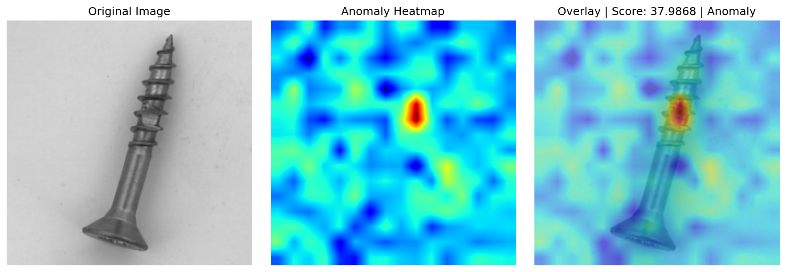
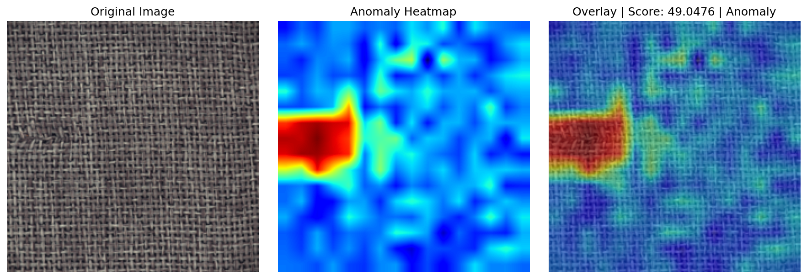

# Visual Anomaly Detection — DINOv2 + PatchCore on MVTec AD

Unsupervised industrial defect detection using self-supervised vision features and memory-bank scoring with spatial localization. No defect labels required during training.

## Results

Evaluated across all 15 product categories in the MVTec AD benchmark:

| Metric | Score |
|---|---|
| Mean AUROC | 0.9781 |
| Std AUROC | 0.0316 |
| Mean Average Precision | 0.9905 |
| Std Average Precision | 0.0130 |
| Categories Evaluated | 15 / 15 |

## Qualitative Results

**Transistor — Burnt Component**


**Screw — Tip Damage**


**Zipper — Broken Tooth**


**Carpet — Pulled Thread**


## What This System Does

Takes a product image as input and outputs an anomaly score plus a spatial heatmap highlighting exactly where the defect is — trained only on normal images, never shown a single defect example.

The system learns what normal looks like from defect-free training images. At inference, anything that deviates from that learned distribution is flagged and localized.

## How It Works

**Step 1 — Feature Extraction**
Each training image is passed through DINOv2 ViT-B/14, a frozen self-supervised vision transformer. The image is split into 256 patches and each patch gets a 768-dimensional feature vector describing that local region.

**Step 2 — Memory Bank**
All patch features from normal training images are collected and compressed using greedy coreset subsampling, keeping a representative 10% subset. This becomes the memory bank of what normal looks like.

**Step 3 — Anomaly Scoring**
At inference, patch features from a new image are compared against the memory bank using nearest-neighbor distance. Patches far from any normal feature are anomalous. The maximum patch distance becomes the image-level anomaly score.

**Step 4 — Spatial Localization**
Patch-level scores are upsampled back to image resolution and overlaid as a heatmap, showing exactly where the defect is located.

## Architecture

```
Input Image (224x224)
        ↓
DINOv2 ViT-B/14 (frozen, no fine-tuning)
        ↓
Patch-level features — 256 patches x 768 dims
        ↓
PatchCore Memory Bank (greedy coreset subsampling at 10%)
        ↓
Nearest-neighbor anomaly scoring per patch
        ↓
Image-level anomaly score + spatial heatmap
```

## Dataset

MVTec AD — 15 industrial product categories, 5354 normal training images, 1725 test images covering normal and anomalous samples.

Categories: bottle, cable, capsule, carpet, grid, hazelnut, leather, metal_nut, pill, screw, tile, toothbrush, transistor, wood, zipper.

Download from https://www.mvtec.com/research-teaching/datasets/mvtec-ad and place at data/mvtec/. This folder is gitignored.


## Setup

```
git clone https://github.com/dixitdevarshi/visual-anomaly-detection.git
cd visual-anomaly-detection

python -m venv venv
venv\Scripts\activate

pip install torch torchvision --index-url https://download.pytorch.org/whl/cu121
pip install -r requirements.txt
```

## Run Pipeline

```
python run_pipeline.py
```

Builds memory banks for all 15 categories, evaluates on test sets, saves AUROC scores to experiments/results/results.json, and saves heatmap visualizations to experiments/results/visualizations/.

## Run Demo

```
streamlit run app/streamlit_app.py
```

Upload any product image and get an anomaly score plus heatmap overlay in real time. Requires memory banks to be built first by running the pipeline.

## Tech Stack

Python, PyTorch, DINOv2, PatchCore, MVTec AD, Streamlit, scikit-learn, matplotlib

## References

- Roth et al., Towards Total Recall in Industrial Anomaly Detection (PatchCore), CVPR 2022
- Oquab et al., DINOv2: Learning Robust Visual Features without Supervision, 2023
- Bergmann et al., MVTec AD: A Comprehensive Real-World Dataset for Unsupervised Anomaly Detection, CVPR 2019