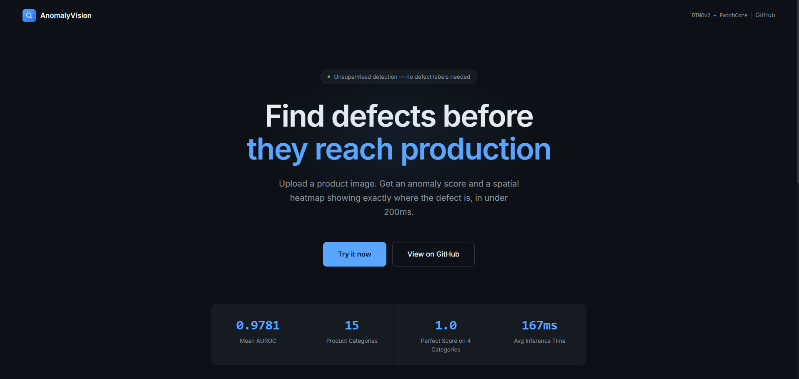
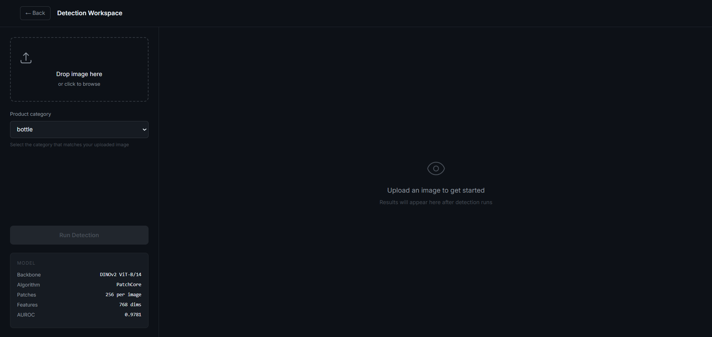
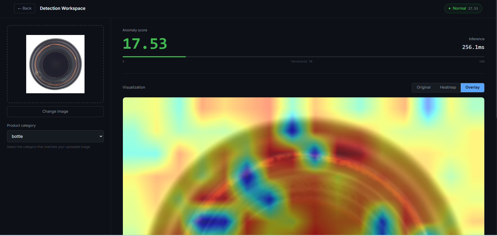
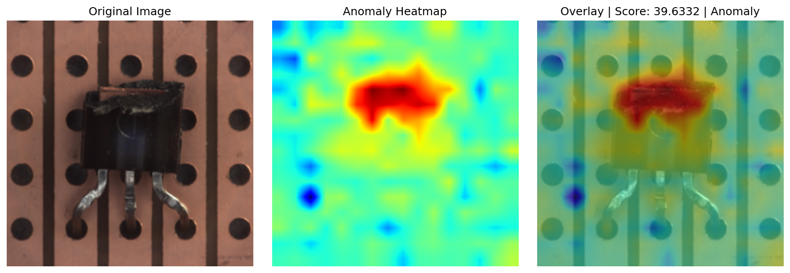
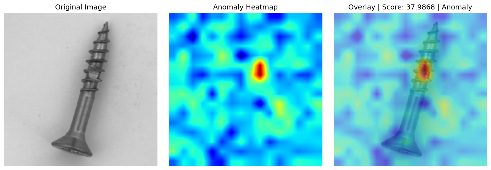
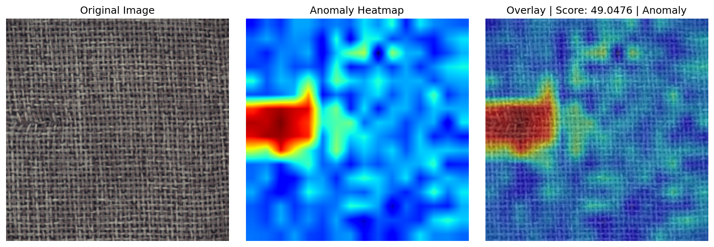
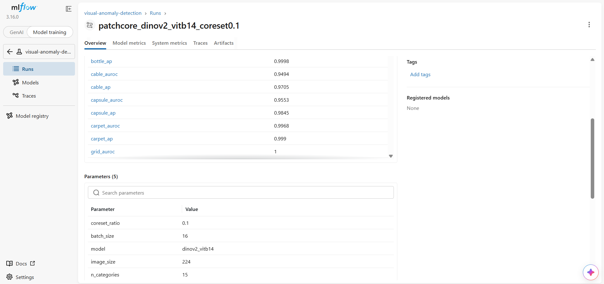
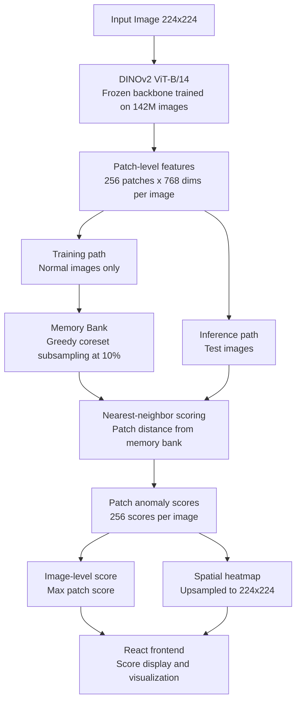

# Visual Anomaly Detection with DINOv2 and PatchCore

Unsupervised industrial defect detection using self-supervised vision features and memory-bank scoring with spatial localization. No defect labels required during training.

## Live Demo







## Results

Evaluated across all 15 product categories in the MVTec AD benchmark:

| Metric | Score |
|---|---|
| Mean AUROC | 0.9781 |
| Std AUROC | 0.0316 |
| Mean Average Precision | 0.9905 |
| Std Average Precision | 0.0130 |
| Categories Evaluated | 15 / 15 |

## Qualitative Results

**Transistor: Burnt Component**


**Screw: Tip Damage**


**Zipper: Broken Tooth**


**Carpet: Pulled Thread**


## Experiment Tracking with MLflow

All runs are tracked with MLflow. Parameters, per-category AUROC, average precision, and heatmap artifacts are logged per run.



## What This System Does

Takes a product image as input and outputs an anomaly score plus a spatial heatmap showing where the defect is. The system is trained only on normal images and never sees a single defect example during training.

It learns what normal looks like from defect-free images. At inference, anything that deviates from that learned pattern gets flagged and localized.

## Architecture


```mermaid
flowchart TD
    A[Input Image 224x224] --> B[DINOv2 ViT-B/14\nFrozen backbone trained on 142M images]
    B --> C[Patch-level features\n256 patches x 768 dims per image]
    C --> D[Training path\nNormal images only]
    C --> E[Inference path\nTest images]
    D --> F[Memory Bank\nGreedy coreset subsampling at 10%]
    F --> G[Nearest-neighbor scoring\nPatch distance from memory bank]
    E --> G
    G --> H[Patch anomaly scores\n256 scores per image]
    H --> I[Image-level score\nMax patch score]
    H --> J[Spatial heatmap\nUpsampled to 224x224]
    I --> K[React frontend\nScore display and visualization]
    J --> K
```

## How It Works

**Step 1: Feature Extraction**
Each training image goes through DINOv2 ViT-B/14, a frozen self-supervised vision transformer trained by Meta on 142 million images. The image is split into 256 patches and each patch gets a 768-dimensional feature vector.

**Step 2: Memory Bank**
All patch features from normal training images are collected and compressed using greedy coreset subsampling, keeping a representative 10% subset. This is the memory of what normal looks like.

**Step 3: Anomaly Scoring**
At inference, patch features from a new image are compared against the memory bank using nearest-neighbor distance. Patches far from anything in memory are anomalous. The maximum patch distance becomes the image-level anomaly score.

**Step 4: Spatial Localization**
Patch-level scores are upsampled back to image resolution and overlaid as a heatmap, showing exactly where the defect is.

## Tech Stack


## Project Structure

```
visual-anomaly-detection/
├── src/
│   ├── data/
│   │   └── dataset.py              # MVTec dataset loader
│   ├── model/
│   │   ├── extractor.py            # DINOv2 frozen feature extractor
│   │   └── patchcore.py            # memory bank and anomaly scoring
│   ├── evaluation/
│   │   └── metrics.py              # AUROC and average precision
│   ├── visualization/
│   │   └── gradcam.py              # patch score heatmap generation
│   └── tracking/
│       └── mlflow_logger.py        # MLflow experiment logging
├── frontend/
│   ├── src/
│   │   ├── pages/
│   │   │   ├── Landing.jsx         # landing page
│   │   │   └── Detector.jsx        # detection workspace
│   │   ├── hooks/
│   │   │   └── useDetection.js     # detection state and API calls
│   │   └── utils/
│   │       └── api.js              # FastAPI client
│   └── package.json
├── notebooks/
│   ├── 01_data_exploration.ipynb
│   ├── 02_feature_analysis.ipynb
│   └── 03_evaluation_results.ipynb
├── tests/
│   └── test_patchcore.py           # 13 unit tests
├── assets/                         # visualizations for README
├── experiments/results/            # evaluation results
├── artifacts/                      # saved memory banks (gitignored)
├── data/                           # MVTec dataset (gitignored)
├── api.py                          # FastAPI backend
├── Dockerfile
├── docker-compose.yml
└── run_pipeline.py
```

## Dataset

MVTec AD has 15 industrial product categories, 5354 normal training images, and 1725 test images covering both normal and anomalous samples.

Categories: bottle, cable, capsule, carpet, grid, hazelnut, leather, metal_nut, pill, screw, tile, toothbrush, transistor, wood, zipper.

Download from https://www.mvtec.com/research-teaching/datasets/mvtec-ad and place at data/mvtec/. This folder is gitignored.

## Setup

```
git clone https://github.com/dixitdevarshi/visual-anomaly-detection.git
cd visual-anomaly-detection

python -m venv venv
venv\Scripts\activate

pip install torch torchvision --index-url https://download.pytorch.org/whl/cu121
pip install -r requirements.txt
pip install fastapi uvicorn python-multipart
```

## Run Pipeline

```
python run_pipeline.py
```

Builds memory banks for all 15 categories, runs evaluation on test sets, saves AUROC scores, heatmap visualizations, and logs everything to MLflow.

## Run with Docker

```
docker compose up --build
```

Starts all three services:
- React frontend at http://localhost:3000
- FastAPI backend at http://localhost:8000
- MLflow UI at http://localhost:5000

## Run Manually

Backend:
```
uvicorn api:app --reload --port 8000
```

Frontend:
```
cd frontend
npm install
npm run dev
```

MLflow:
```
mlflow ui
```

## Testing

```
pytest tests/ -v
```

13 unit tests covering PatchCore initialization, memory bank fitting, anomaly scoring, save/load, and coreset subsampling. CI runs automatically on every push via GitHub Actions.

## References

Roth K., Pemula L., Zepeda J., Scholkopf B., Brox T., Gehler P. Towards Total Recall in Industrial Anomaly Detection. CVPR 2022. https://arxiv.org/abs/2106.08265

Oquab M., Darcet T., Moutakanni T., et al. DINOv2: Learning Robust Visual Features without Supervision. arXiv 2023. https://arxiv.org/abs/2304.07193

Bergmann P., Fauser M., Sattlegger D., Steger C. MVTec AD: A Comprehensive Real-World Dataset for Unsupervised Anomaly Detection. CVPR 2019. https://openaccess.thecvf.com/content_CVPR_2019/html/Bergmann_MVTec_AD_--_A_Comprehensive_Real-World_Dataset_for_Unsupervised_Anomaly_CVPR_2019_paper.html